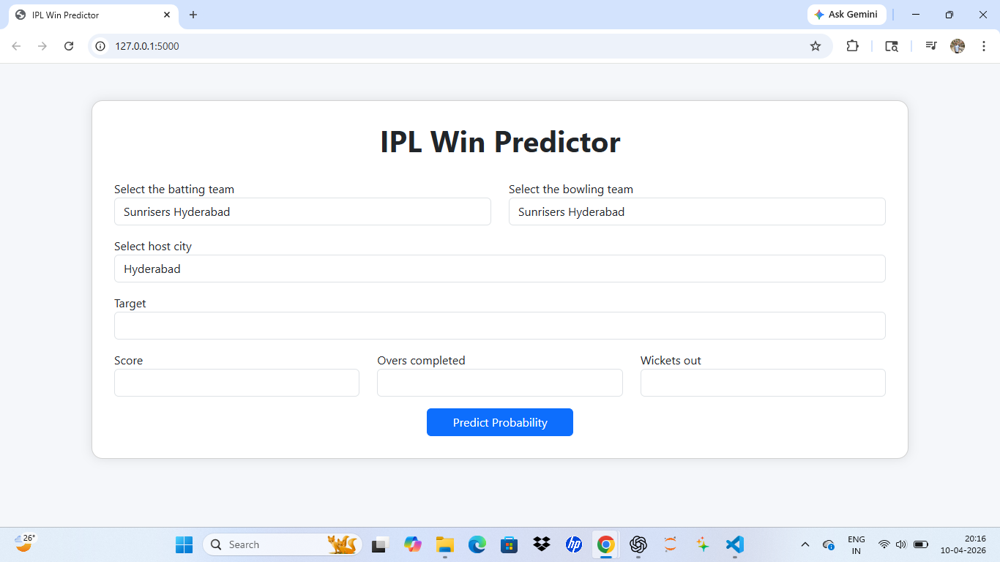

# 🏏 IPL Win Predictor

A Machine Learning based web application that predicts the winning probability of IPL teams based on real-time match inputs.

---

## 📸 Screenshot


---

## 🚀 Features
- Real-time win probability prediction
- Clean and responsive UI
- Flask-based web application
- Machine Learning model using Scikit-learn

---

## 🧠 Tech Stack
- Python
- Flask
- Scikit-learn
- Pandas, NumPy
- HTML, CSS, Bootstrap

---

## ⚙️ How to Run

```bash
git clone https://github.com/yogeshgupta89577-max/IPL-win-predictor.git
cd IPL-win-predictor
python -m venv myenv
myenv\Scripts\activate
pip install -r requirements.txt
python app.py

## 🙌 Author
**Yogesh Gupta**  
GitHub: https://github.com/yogeshgupta89577-max
